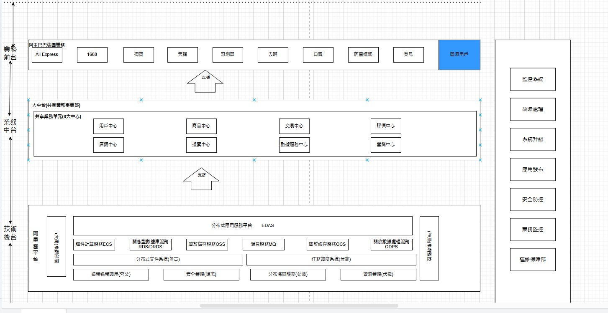

# 軟體工程期末報告如何展示你的架構-"4+1"視圖
<h1>
    組員:  11124111 王志節、11124114 黃安德
</h1>
「4+1」視圖是對邏輯架構進行描述，最早由 Philippe Kruchten 提出，他在1995年的《IEEE Software》上發表了題為
《The 4+1 View Model of Architecture》的論文，引起了業界的極大關注，現在是軟體設計的結構標準 - 百度百科
總的來說，只要你去做報告/寫ppt，你總是要畫一兩個視圖的。
4代表了4中視圖，1表示基於某一個場景，結合4中視圖進行說明。
作者：Huld多
連結：https://www.jianshu.com/p/061e68b54fb0
來源：簡書
著作權歸作者所有。商業轉載請聯絡作者授權，非商業轉載請註明出處。

1. 邏輯視圖（Logical View）
  設計的物件模型，改成了用uml來表示。

2. 過程/進程視圖（Process View）
  捕捉設計的並發和同步特徵。這個圖有點抽象，主要需要表現出線程，進程之間的關係。

3. 物理視圖（Physical View），描述了軟體到硬體的映射，反映了分散式特性。你的實體網路如何搭建。

4. 開發視圖（Development View），描述了在開發環境中軟體的靜態組織結構。包含哪些功能模組。

資料來源:  https://www.jianshu.com/p/061e68b54fb0
