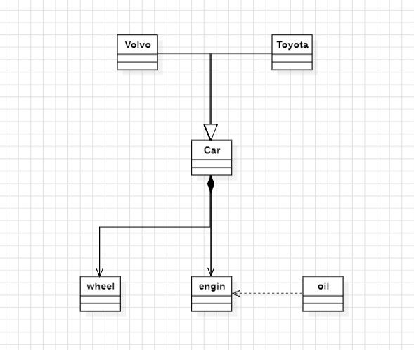
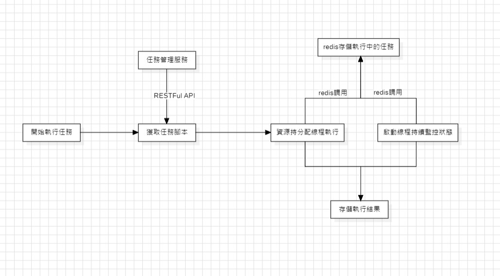
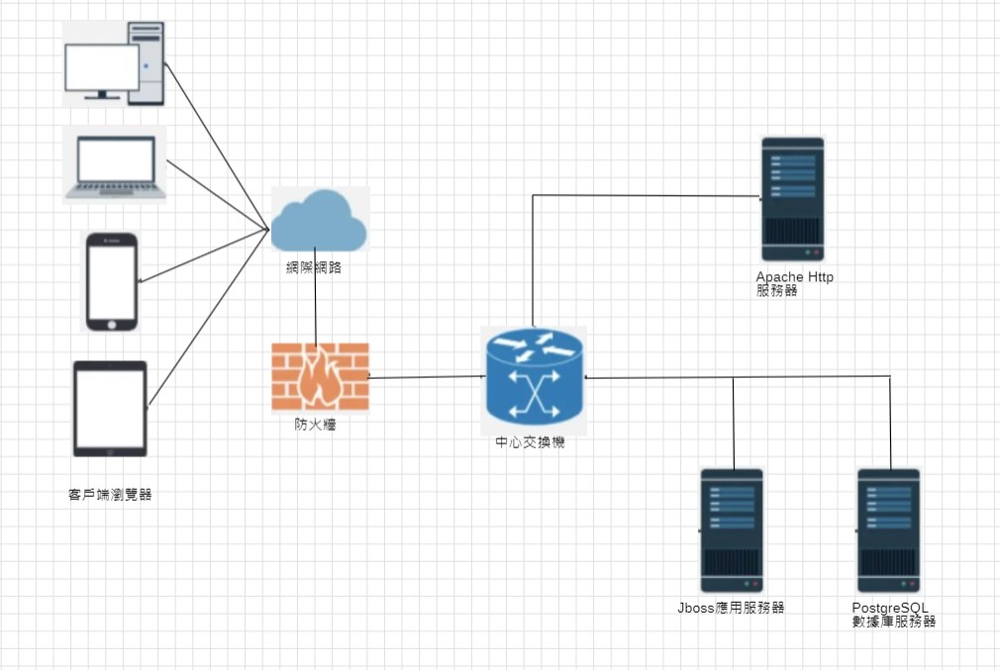

# 軟體工程期末報告如何展示你的架构-"4+1"视图
<h1>
    組員:  11124111 王志節、11124114 黃安德
</h1>
“4+1”视图是对逻辑架构进行描述，最早由 Philippe Kruchten 提出，他在1995年的《IEEE Software》上发表了题为
《The 4+1 View Model of Architecture》的论文，引起了业界的极大关注，现在是软件设计的结构标准 - 百度百科
总的来说，只要你去做汇报/写ppt，你总是要画个一两个视图的。
4代表了4中视图，1表示基于某一个场景，结合4中视图进行说明。
作者：Huld多
链接：https://www.jianshu.com/p/061e68b54fb0
来源：简书
著作权归作者所有。商业转载请联系作者获得授权，非商业转载请注明出处。

1. 逻辑视图（Logical View）
  设计的对象模型，改成了用uml来表示。

2. 过程/进程视图（Process View）
  捕捉设计的并发和同步特征。这个图有点抽象，主要需要表现出线程，进程之间的关系。

3. 物理视图（Physical View），描述了软件到硬件的映射，反映了分布式特性。你的物理网络如何搭建。

4. 开发视图（Development View），描述了在开发环境中软件的静态组织结构。包含哪些功能模块。

資料來源:  https://www.jianshu.com/p/061e68b54fb0
